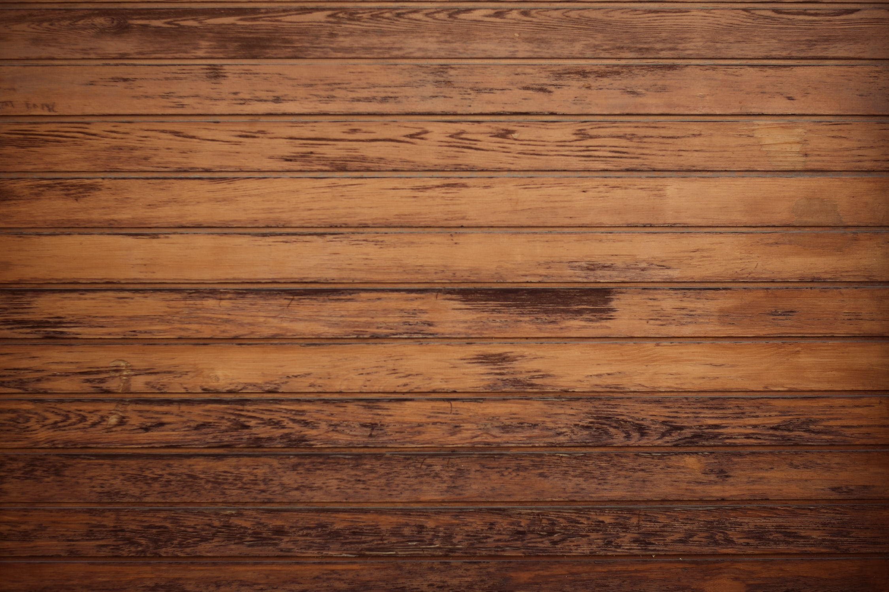

# Opdracht5
Interaction

<!DOCTYPE html>
<html>
  <head>
    <meta charset="utf-8">
    <title>Hello, WebVR! • A-Frame</title>
    <meta name="viewport" content="width=device-width">
    
    
  </head>
  <body>
    <a-scene background="color: #333333">
      <a-assets>
          
          
          
      </a-assets>

      <a-entity id="mouseCursor" cursor="rayOrigin: mouse"></a-entity>

      <a-box id="myBox" 
        position="-1 1 -3" 
        rotation="0 45 0" 
        width="3" 
        height="1" 
        depth="1" 
        material="src: #wood"
        shadow 
        animation__mouseenter="
          property: components.material.material.color; 
          type: color; 
          to: blue; 
          startEvents: mouseenter; 
          dur: 500;"
        animation__mouseleave="
          property: components.material.material.color; 
          type: color; 
          to: red; 
          startEvents: mouseleave; 
          dur: 500;">  
      </a-box>
      <a-box id="myOtherBox" 
        position="2 1 -3" 
        rotation="0 45 0" 
        width="3" 
        height="1" 
        depth="1" 
        material="src: #wood"
        shadow>  
      </a-box>
      <a-plane id="ground"
        position="0 0 -4" 
        rotation="-90 0 0" 
        width="100" 
        height="100" 
        color="#7BC8A4" 
        material="src: #grass; repeat: 10 10"
        shadow>
      </a-plane> 
    </a-scene>
  </body>
</html>
